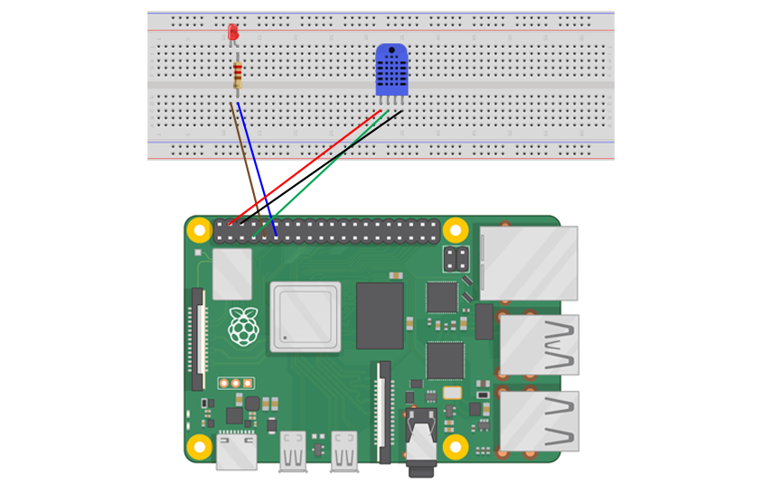
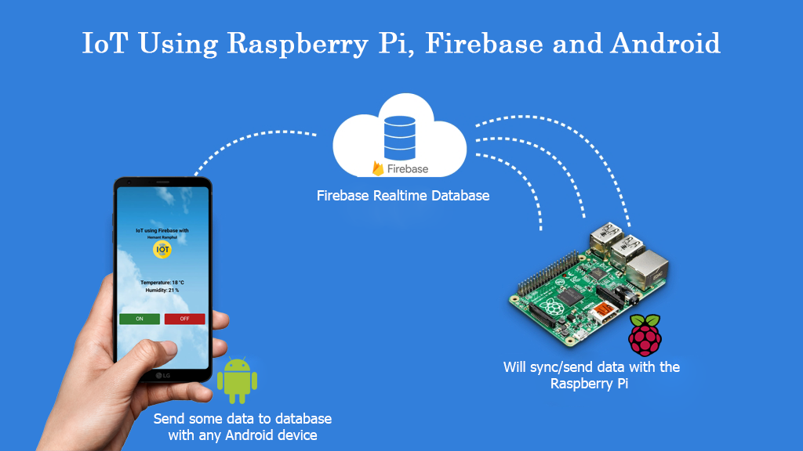

# IoT Using Raspberry Pi and Firebase and Android

In a nutshell, I will create a smart device that can get temperature and humidity wirelessly using DHT11 with Raspberry Pi 4 over Wi-Fi on your Android smartphone. This project is divided into three main parts.

-	Android mobile application.
The mobile app which read temperature and humidity sensor data on real time.
-	Database.
Firebase database will receive some data from the mobile app or Raspberry Pi.
-	Electronic and control circuit.
The control circuit will be based on the raspberry pi board which running a python script reading the incoming data from the firebase database and according to these data will take some different actions.

#### Purpose
To create an android app and send data to Firebase RealTime Database.

#### Language
Implementation in Python with Raspberry Pi 4

#### Wiring Diagram

#### How it works?

#### Plugins and others

| Plugins             | Source                                                                 |
| ----------------- | ------------------------------------------------------------------ |
| pyrebase | https://github.com/nhorvath/Pyrebase4 |
| Adafruit_DHT | https://github.com/adafruit/Adafruit_Python_DHT.git |
| Firebase | https://console.firebase.google.com/ |
| MIT App Inventor | http://appinventor.mit.edu/ |
| Raspberry Pi 4B | https://www.raspberrypi.com/products/raspberry-pi-4-model-b/ |

## 🚀 About Me
I'm a full stack developer...

Author: Hemant Ramphul
Github: https://github.com/hemantramphul/IoT-Using-Raspberry-Pi-and-Firebase-and-Android
Date: 07 Decemeber 2022

___

##### Université des Mascareignes (UdM)
Faculty of Information and Communication Technology  
Master Artificial Intelligence and Robotics  
Official Website: https://udm.ac.mu  

**Free Software, Hell Yeah!** 👋
